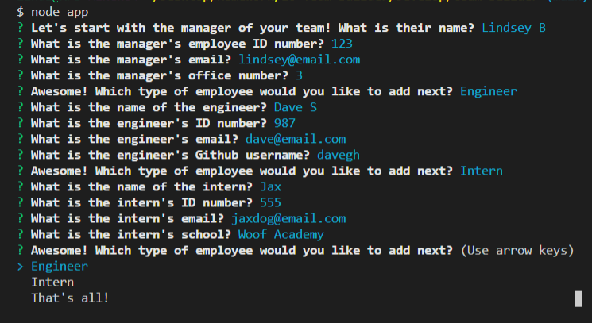
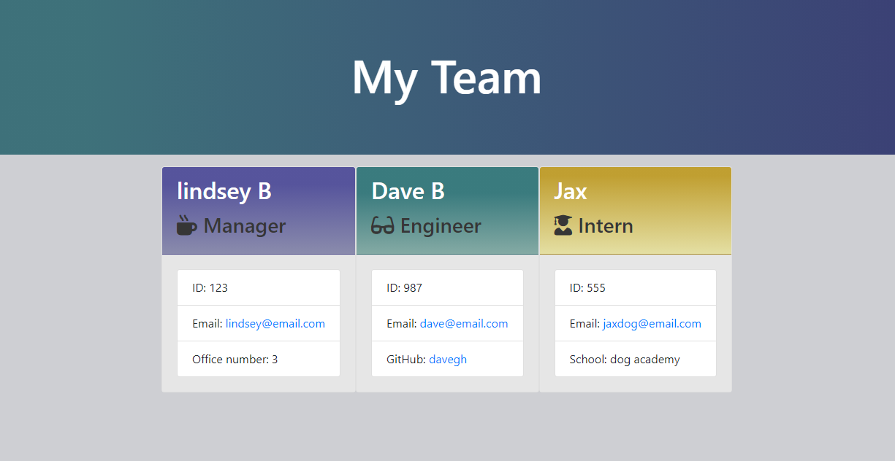

# Team Builder
  
  

  ## Description
  Run through Node CLI, this is a command line application that generates a beautifully styled HTML team directory page. Inquirer npm is  utilized to prompt the user for information about each team member. Then, the program uses constructor methods to push the obtained data to an HTML template. This program comes complete with tests so that the user can have confidence in its execution.

  ## Table of Contents
  * [**Installation**](#installation)
  * [**Usage**](#usage)
  * [**Contributing**](#contributing)
  * [**Tests**](#tests)
  * [**License**](#license)
  * [**Questions**](#questions)

  ## Installation
  Commands to run to install dependencies: npm install

  ## Usage
  After running npm i, run the program via the command line argument "node app". You will be prompted to enter your team's information. When complete, a new directory called "output" will appear with your file inside: "team.html". Open "team.html" in a browser to see it.

  Here is a walkthrough of the app's functionality: https://drive.google.com/file/d/1W3-V85LQ7BQ3GyJccPdDGqIlGruFWzmA/view

  Here are photos of the app in use and an example finished product:

  
  

  ## Contributing
  Contact me if you're interested in contributing to this project.

  ## Tests
  Command to run tests: npm run test

  ## License
  The contents of this repository are protected under the MIT license

  ## Questions
  Follow me on GitHub at https://github.com/LindseyM20

  Please contact me with any questions or feedback at lindsey.bordner@gmail.com 
